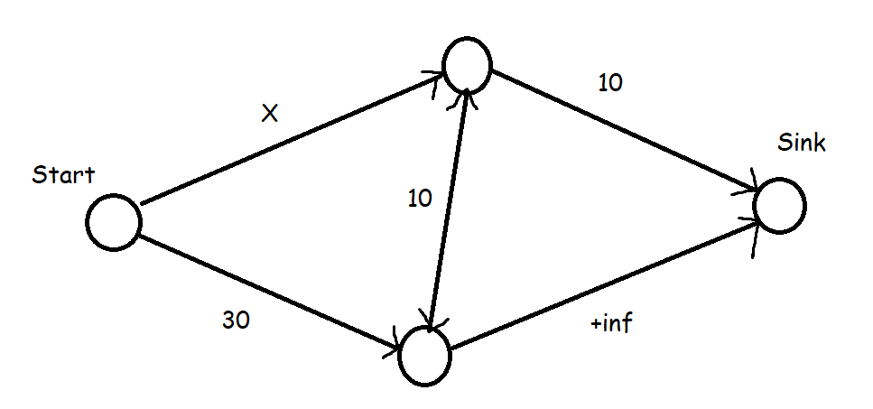

<!---
Template -

# Problem name - pid
## Topics:
## Properties:
## Solution idea:
## Complexity analysis:
## Worked example:
\square 
-->

<!---Variables-->

[id_example]: https://www.google.se/
<!--- [link text to id src][id_example] -->
[dpLink]: https://en.wikipedia.org/wiki/Dynamic_programming#Computer_programming
[dagLink]: https://en.wikipedia.org/wiki/Directed_acyclic_graph
[dijk]: https://en.wikipedia.org/wiki/Dijkstra%27s_algorithm
[dmst]: https://www.cs.tau.ac.il/~zwick/grad-algo-13/directed-mst.pdf
[dinic]: https://en.wikipedia.org/wiki/Dinic%27s_algorithm
<!---Document-->

# IMPA ht22 omgång 2, 19/9-09/10 - Writeup - (experimental)

The following document tries to provide solution ideas to all problems of categories [medlelsvår, ganska svår, mycket svår] of a previously finished IMPA round. The purpose of this document is to share solution ideas across all IMPA participants. Some problems in this document may have a red  Wanted tag in their title. This means that a solution idea is not yet available and invites readears who know of a solution to contribute by emailing the document administrator. Any contributions will be creadited to the contributor, unless told otherwise by the contributor. Any questions, errors, suggestions, etc. can also be emailed to the document administrator.

**Contact:** ordf@lithekod.se (Lowe Kozak Åslöv)

# Wedding shopping - p11450

## Topics:
[Dynamic programming][dpLink]

## Solution idea:

We are going to buy $C$ different garments, one model from each garment type. We can solve this with dynamic programming if we split it up into different arrays, where $dp_n$ takes the first $n$ garments into account. Let $dp_1$ be an array of size $M+1$ filled with 0's. Now set $dp_1[c] = 1$ for each $c$ denoting a cost of a model of the first garment type. This array will be our initial case taking the first garment type into consideration. We can now formulate a transition step to account for the next garment type, $dp_2$, with  $dp_k[i] = dp_{k-1}[i-c]+1 \text{ iff } dp_{k-1}[i-c] = k-1$ where $c$ is a model cost of garment type $k$, and $i$ is our iterator over the array. Our answer will be the highest index of $dp_C$ that has a value of $C$.

# Su Doku - p989  Wanted

# Elegant Strings - p11381  Wanted

# Little Red Riding Hood - p11067

## Topics:
[Dynamic programming][dpLink]

## Solution idea:

We can solve this problem backwards from the goal square. Note that, if we consider ourselves standing on a square adjacent to the goal square, there is only one way to step into the goal. For squares with a manhattan distance of two to the goal, we can say that the number of ways to reach the goal from here, is the number of ways from one square to the right plus the number of ways from one square up. In other words, if we let $dp[r][c]$ be our grid (starting square $dp[r][0]$ and goal square $dp[0][c]$), then we can say that $dp[i][j] = dp[i-1][j] + dp[i][j+1]$ ONLY IF we go through the grid in a BFS order starting from the goal. i.e. make sure that we have calculated $dp[i-1][j] \text{ and } dp[i][j+1]$ before we evaluate $dp[i][j]$. To take the wolves into consideration, we simply set the points with wolves to $0$ when we encounter them. This ensures that points that can move up or right into a point with a wolf, the $dp$ transition adds a $0$ for that path, which is the same as not using that path since it doesn't contribute with anything. The answer is at $dp[r][0]$. 

# Weights and Measures - p10154

## Topics:
[Dynamic programming][dpLink]

## Solution idea:

Claim: There exist an ordering of turtles with descending strength that can compose a tower of height not lower than the highest tower possible. (ordering here means that the first turtle, the strongest one, goes on the bottom and every subsequent turtle is placed on top of the tower.)

Proof: Consider two turtles. Turtle $t_1$ with weight and strength $w_1$ and $s_1$. And $t_2$ with $w_2$ and $s_2$. Wlog. assume that $s_1 \geq s_2$.
Placing $t_2$ on top of $t_1$, we have the remaining lifting capacities:

$t_1$: $s_1-(w_1+w_2)$ \
$t_2$: $s_2-w_2$

Since $s_1$ is larger than or equal to $s_2$, this way of placing maximizes the minimum remaining lifting capacity. And since the tower itself only ever is restricted by the minimum remaining lifting capacity of the single weakest turtle, this ordering ensures that we maintain a maximum minimum lifting capacity over the whole tower. I.e. it holds that
$max(min(s_1-(w_1+w_2),s_2-w_2)) \geq max(min(s_2-(w_1+w_2),s_1-w_1))$ under the asumption that $s_1 \geq s_2$. $\square$

Imposing the order of iterating over the turtles in decreasing strength, we can construct an array $H[i]$ that saves the best remaining capacity for a tower with $i$ turtles. We can then formulate the transition as $H[i] = max(H[i],min(H[i-1]- weight(t), strength(t)-weight(t)))$ for a turtle $t$. Note that we have to iterate from higher $i$ to lower so to avoid double usage of the same turtle. Answer is at the heighest index value $i$ of $H[i]$ that could be constructed.

# Teen Girl Squad - p11183  Wanted

## Topics:
[Directed Minimum Spanning Tree][dmst]

# Round and Round Maze - p985

## Topics:
[Shortest path][dijk]

## Solution idea:

Each cell has four states that it cycles through. We may think of each cell as four different nodes, each node represeting a different state of the cell. Note that the change over all states is synchronous, therefore we only ever have to care about the shortest way of reaching each node. We can construct the graph with nodes $G[cycle][r][c]$ where cycle goes from 0 to 3 inclusive, r denotes row and c denotes columns. We connect the nodes by bumping the cycle, and moving along ther row/col according to the arrows. For example: 

A north arrow 'N' would connect $G[cycle][r][c]$ with $G[(cycle+1) \text{ mod } 4][r-1][c]$, and then 
$G[(cycle+1) \text{ mod } 4][r][c]$ with $G[(cycle+2) \text{ mod } 4][r][c+1]$ (east) and so on for each letter.
Then we run dijkstras from our starting node $G[0][0][0]$ and output the number we get when we first reach $G[cycle][r-1][c-1]$ for any number $cycle$.

# IBM Fencing - p11759  Wanted

# Component Placement - p11765
## Topics:
[Maxflow][dinic]

## Solution idea:

There exist a [theorem](https://en.wikipedia.org/wiki/Max-flow_min-cut_theorem) that states that the max-flow of a network and the minimum-cut are the same. In this problem we want to find a minimum cost which we can formulate as a Minimum-cut problem, but we solve for the dual of the problem, the max flow, instead. Essentially, the min-cut formulation of this problem uniquely identifies a solution through the edges that are cut. Since there are only two choices for each component, over or under, we can reflect this in our graph with the two choices "start node to component node", OR "component node to sink node". Constructing the graph this way guarantees that a cutting that separates the start node and the sink node entails a placement choice for each component. We construct the graph as follows:

 We have a start node and a sink node, and then every node inbetween is mapped to a component of the input, where the connecting edges represent our possible choices for that component. For a node $c_i$ represeting component $i$ without placement requirements, we let an edge from the start node to $c_i$ have flow capacity equal to the cost of placing the component on the top of the board. We let an edge from $c_i$ to the sink node have flow capacity equal to the cost of placing the component on the bottom of the board. If a component must be placed on the top of the board, we set the flow capacity from the the component to the sink to $+inf$. Likewise, if it must be placed on the bottom of the board, we set the capacity of edge connecting the start to component to $+inf$. If two components $c_i$ and $c_j$ must be interconnected, then we add two edges between $c_i$ and $c_j$, one in each direction with the capacity of the interconnection cost.

The intuition behind how interconnections interact with the graph can be illustrated with the image below. If X is set to something larger than $20$, we see that it will fill both $10$-connections, meaning that it is cheaper to choose the interconnection cost and the cost of placing the component under the board, rather than paying more than $20$ for placing it on top of the board. If X is smaller than $20$, then the interconnection and sink connection are restricted in flow (in some way) due to the better cost of placing the component on top.

